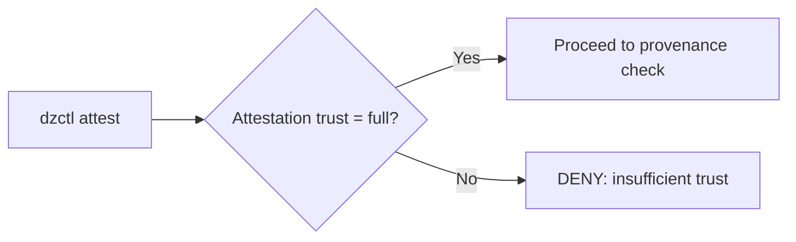
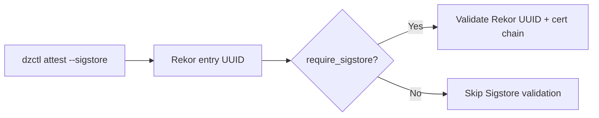

# DriftZero Policy Reference

> _“Policy is the line between trust and regret.”_  
> — EnvSecOps Working Group, v0.1.1

---

## 🧭 Overview

DriftZero policies define **when**, **where**, and **how** credentials or actions may be performed.  
They are evaluated by the control plane each time a client requests a sensitive operation — for example:

```bash
dzctl credentials request --target prod --scope deploy
````

The control plane retrieves the applicable policy (`dz://policy/deploy-prod`), evaluates the provided **attestation**, **provenance**, and **context**, and returns a **decision** (`ISSUED` or `DENIED`).

---

## 🧩 Policy Object Structure

| Field           | Type   | Required | Description                                                                    |
| --------------- | ------ | -------- | ------------------------------------------------------------------------------ |
| `policy_id`     | string | ✅        | Canonical ID for the policy, e.g. `dz://policy/deploy-prod`.                   |
| `description`   | string | ❌        | Human-readable summary of what this policy governs.                            |
| `allow_actions` | array  | ✅        | Whitelisted actions this policy allows (e.g., `deploy`, `apply`, `read-logs`). |
| `conditions`    | object | ✅        | Constraints evaluated by the control plane before approval.                    |
| `version`       | string | ❌        | Semantic version of the policy definition for governance and change tracking.  |

---

## ⚙️ Condition Fields and Enforcement Logic

### `required_environment_trust`

* **Type:** `string`
* **Enum:** `["full", "limited", "none"]`
* **Purpose:** Specifies the minimum environment attestation confidence required.

| Value     | Behavior                                                                                                                  |
| --------- | ------------------------------------------------------------------------------------------------------------------------- |
| `full`    | Requires a valid DriftZero attestation including hardware anchors (TPM, Nitro Enclave, or VTPM) and signed `dz-manifest`. |
| `limited` | Allows software-only attestations (e.g., container hash and checksum validation).                                         |
| `none`    | Skips environment verification (for low-risk, read-only actions).                                                         |

**Example Control Flow:**



---

### `required_provenance_level`

* **Type:** `integer`
* **Range:** `0–4`
* **Purpose:** Enforces a minimum **SLSA** provenance level for any referenced artifact.

| Level | Requirement                                          |
| ----- | ---------------------------------------------------- |
| 0     | No guarantees                                        |
| 1     | Scripted builds                                      |
| 2     | Authenticated builds                                 |
| 3     | Verified, hermetic, non-falsifiable builds           |
| 4     | Reproducible builds with full dependency attestation |

**Example Use:**

```yaml
conditions:
  required_provenance_level: 3
```

The control plane will validate that the attached `provenance.json` satisfies SLSA Level ≥ 3 before credentials are granted.

---

### `require_sigstore`

* **Type:** `boolean`
* **Purpose:** Enforces Sigstore-backed signing for environment attestations.

If `true`, DriftZero control plane requires:

* A valid **Fulcio-issued certificate** proving signer identity.
* A verifiable **Rekor log entry** (UUID and log index).
* Signature hash match between submitted attestation and Rekor transparency log.

**Policy Enforcement Flow:**



---

### `max_ttl_seconds`

* **Type:** `integer`
* **Purpose:** Sets the upper bound on credential lease duration issued under this policy.
* **Enforced by:** control plane’s credential issuance logic.

**Example:**

```yaml
max_ttl_seconds: 900
```

→ Credentials expire after **15 minutes**, even if the requesting environment remains valid.

---

### `allowed_targets`

* **Type:** `array` of `string`
* **Purpose:** Restricts credential issuance or action execution to specific, approved targets.

| Example                        | Description                          |
| ------------------------------ | ------------------------------------ |
| `aws-prod-account-1234`        | AWS account alias or ARN             |
| `k8s://cluster/prod-us-east-1` | Kubernetes context or API endpoint   |
| `azure://subscription/prod`    | Azure subscription or resource group |

If the request’s `target` value doesn’t match an `allowed_target`, the control plane will deny issuance.

---

## 🧠 Example Evaluation

```bash
dzctl credentials request \
  --target aws-prod-account-1234 \
  --scope deploy \
  --attestation attestation.json \
  --provenance provenance.json
```

Control Plane evaluates:

1. ✅ Attestation verified (trust = `full`)
2. ✅ Provenance = SLSA Level 3
3. ✅ Sigstore signature present and verified in Rekor
4. ✅ Target matches allowed list
5. ✅ Requested TTL = 900 ≤ `max_ttl_seconds`

**Decision:**
`ISSUED`
**Audit Event:**
Logged to `/audit/events` with `attestation_id`, `rekor_uuid`, and credential `ttl`.

---

## 🧾 Policy Example Summary

```yaml
policy_id: dz://policy/deploy-prod
description: Allow verified CI/CD pipelines to deploy SLSA-compliant builds.
allow_actions: [deploy]
conditions:
  required_environment_trust: full
  required_provenance_level: 3
  require_sigstore: true
  max_ttl_seconds: 900
  allowed_targets:
    - aws-prod-account-1234
version: v1.0.0
```

---

## 🧱 Implementation Tips

* **Version policies** and record them in the ledger.
* Use **`require_sigstore: true`** for production, but **false** for local dev/test.
* Combine **SLSA** + **Sigstore** enforcement for end-to-end supply-chain integrity.
* Each control-plane decision is cryptographically signed and auditable via `/audit/events`.

---

## 🔮 Next Steps

Upcoming spec milestones will add:

| Feature           | Description                                                                |
| ----------------- | -------------------------------------------------------------------------- |
| `dz-policy.v2`    | Add expression syntax (`when:`, `unless:`) for dynamic enforcement.        |
| Policy federation | Remote policy resolution (dz://org/policies/base-deploy).                  |
| Policy provenance | Sign policies themselves and publish to Rekor for governance traceability. |

---

> “Zero Trust isn’t about paranoia.
> It’s about math, memory, and a healthy disrespect for convenience.”
> — *DriftZero Maintainers, v0.1.1*

